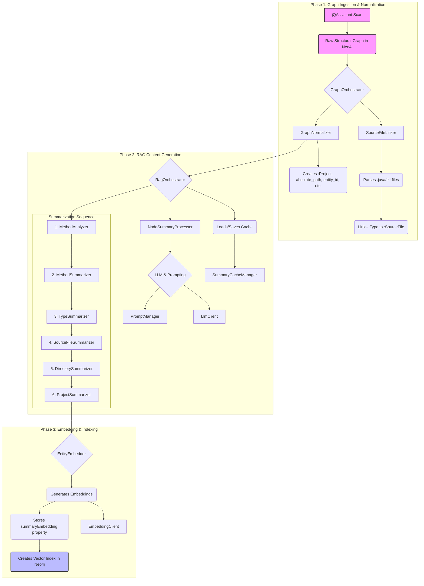

# High-Level Architecture of the jQAssistant GraphRAG Project

This document provides a high-level overview of the design and architecture for the jQAssistant-based GraphRAG (Retrieval-Augmented Generation) project. The system is designed to analyze a software project's structure, enrich it with AI-generated summaries, and create vector embeddings to enable semantic code search and analysis.

## 1. Core Philosophy

The system operates in distinct, sequential phases. It begins by taking a raw, structural graph generated by jQAssistant and systematically normalizes it into a predictable structure. Then, it builds a semantic layer on top by generating summaries in a bottom-up fashion, respecting the code's natural hierarchy and dependencies. Finally, it creates vector embeddings from these summaries to power RAG capabilities.

This phased, bottom-up approach ensures that when a summary for a component (like a class or directory) is generated, the summaries of its constituent parts (its methods or files) are already available, providing rich context to the Large Language Model (LLM).

## 2. System Architecture Diagram

The following diagram illustrates the major components and the data flow through the system.

## 3. Architectural Phases

### Phase 1: Graph Ingestion and Normalization

This initial phase is concerned with transforming the raw, and sometimes ambiguous, jQAssistant graph into a clean, stable, and predictable structure for analysis.

1.  **jQAssistant Scan**: An external process where jQAssistant scans the project's compiled artifacts (e.g., JAR files) to produce a structural graph in Neo4j.
2.  **GraphOrchestrator**: This is the entry point for the enrichment process. It first determines the project's root path from the graph.
3.  **SourceFileLinker**: It parses all `.java` and `.kt` files in the project directory using `tree-sitter`. It extracts Fully Qualified Names (FQNs) of declared types and creates `[:WITH_SOURCE]` relationships between the corresponding `:Type` nodes in the graph and the `:File` nodes representing the source files.
4.  **GraphNormalizer**: This component executes a series of critical normalization passes:
    *   **`:Project` Node Creation**: Creates a single root `:Project` node to act as a unified entry point for analysis.
    *   **Path Normalization**: Adds an `absolute_path` property to all file-system-like nodes (`:File`, `:Directory`) to resolve the context-dependent nature of the default `fileName` property.
    *   **Source File Labeling**: Labels all `.java` and `.kt` files with a distinct `:SourceFile` label.
    *   **Hierarchy Establishment**: Creates a clean, direct parent-child directory structure using the `[:CONTAINS_SOURCE]` relationship.
    *   **Entity ID Generation**: Creates a stable, unique `entity_id` (an MD5 hash of a composite key) for every node relevant to the RAG process and labels them as `:Entity`. This ID is crucial for caching and dependency tracking.

### Phase 2: RAG Content Generation (Summarization)

This phase builds the semantic layer by generating descriptive summaries for nodes in a specific, bottom-up order.

1.  **RagOrchestrator**: Manages the entire RAG generation pipeline. It initializes the clients, managers, and summarizer components.
2.  **Summarization Sequence**: The orchestrator invokes a series of summarizer modules in a strict order to ensure dependencies are processed first.
    *   `MethodAnalyzer` & `MethodSummarizer`: First, methods are analyzed for their technical function based on their source code. Then, they are summarized based on this analysis and the context of their callers and callees.
    *   `TypeSummarizer`: Summarizes classes, interfaces, etc., based on the summaries of their declared methods/fields and the types they inherit from. It processes types in levels, from base types to derived types.
    *   `SourceFileSummarizer`: Aggregates the summaries of the types within a single source file.
    *   `DirectorySummarizer`: Works bottom-up, summarizing directories based on the content of their child files and subdirectories.
    *   `ProjectSummarizer`: The final pass, which creates a top-level summary of the entire project based on its top-level directories.
3.  **Core Logic (`NodeSummaryProcessor`)**: This stateless component is the heart of the summarization process. For any given node, it decides whether a new summary is needed by checking if its dependencies have changed. It orchestrates the generation, including handling contexts that are too large for the LLM by chunking the input and iteratively refining the summary.
4.  **Caching (`SummaryCacheManager`)**: To ensure efficiency and prevent redundant LLM calls, this manager persists all generated summaries and content hashes to a JSON file (`.cache/summary_cache.json`). It also maintains a runtime status of which nodes were changed in the current execution, allowing the `NodeSummaryProcessor` to easily check if a node's summary is stale.

### Phase 3: Embedding and Vector Indexing

This final phase makes the generated knowledge searchable.

1.  **EntityEmbedder**: This component runs after all summaries have been generated.
2.  **Embedding Generation**: It finds all `:Entity` nodes with a `summary` property, sends the summary text to an `EmbeddingClient` (e.g., a local `SentenceTransformer` model), and stores the resulting vector in a `summaryEmbedding` property on the node.
3.  **Vector Index Creation**: After generating embeddings, it ensures that a vector index exists in Neo4j on the `summaryEmbedding` property. This index allows for efficient cosine similarity searches, which is the foundation of the RAG query process.

## 4. Key Components

-   **Orchestrators (`GraphOrchestrator`, `RagOrchestrator`)**: High-level coordinators that define and execute the sequence of operations for a major phase.
-   **Summarizers (`MethodSummarizer`, `TypeSummarizer`, etc.)**: Each is a `BaseSummarizer` responsible for a specific summarization pass. They query the graph for nodes to process, and the `BaseSummarizer` template handles the parallel execution and database updates.
-   **`NodeSummaryProcessor`**: The stateless brain that contains the core logic for generating a summary for a single node, including dependency checking, cache interaction, and iterative summarization for large contexts.
-   **`SummaryCacheManager`**: Manages the on-disk cache for summaries and content hashes, providing persistence and efficiency between runs.
-   **Clients (`LlmClient`, `EmbeddingClient`, `Neo4jManager`)**: Low-level clients responsible for interfacing with external services: the LLM, the embedding model, and the Neo4j database.
-   **Parsers (`JavaSourceParser`, `KotlinSourceParser`)**: Use `tree-sitter` to parse source code and extract metadata needed to link the structural graph (from bytecode) to the source code.
-   **Managers (`PromptManager`, `TokenManager`, `LogManager`)**: Utility classes that handle prompt templating, token counting/chunking, and logging, respectively.

## 5. Execution Flow

The application is executed from `main.py`.

1.  **Initialization**: Parses command-line arguments, initializes logging, and connects to Neo4j.
2.  **Graph Enrichment**: An instance of `GraphOrchestrator` is created. It runs all the normalization and linking passes (Phase 1).
3.  **RAG Generation (Optional)**: If the `--generate-summary` flag is provided, an instance of `RagOrchestrator` is created. It loads the cache, runs all the summarization passes (Phase 2), and then the embedding pass (Phase 3).
4.  **Cache Persistence**: The `RagOrchestrator` ensures the summary cache is saved to disk upon completion or failure.
